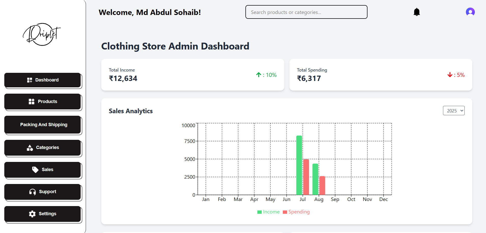
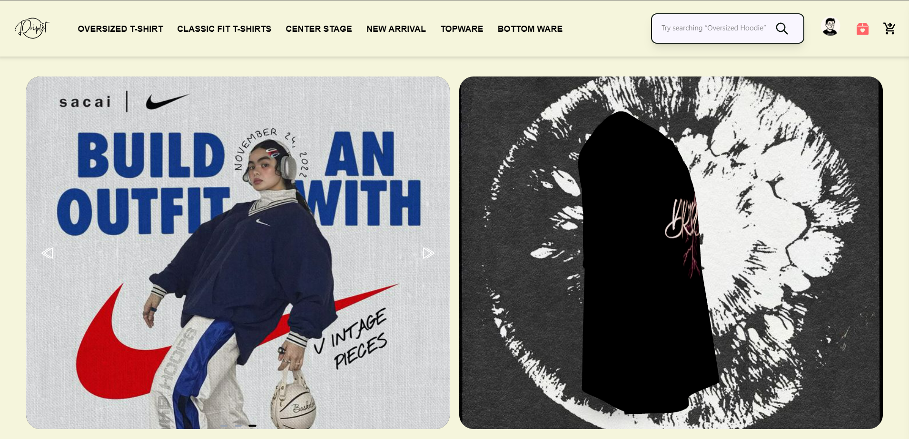

# 🛍️ Driplet Clothing Store – Full-Stack MERN eCommerce Platform

A **fashion-focused**, **secure**, and **scalable** full-stack eCommerce platform for customizable T-shirt sales.  
Includes a **custom-built Admin Panel** & **Client Panel** with seamless UI/UX, secure authentication, and integrated payments.

---

## 📸 Screenshots

### 🖥️ Admin Panel


### 👕 Client Panel


> *Note:* Replace `assets/admin-dashboard.png` and `assets/client-home.png` with actual screenshots from your project.

---

## 🚀 Features

✅ **Custom Admin Panel** – Manage products, orders, and inventory  
✅ **Client Panel** – Responsive & fashion-first shopping experience  
✅ **Authentication** – Clerk for Admin, JWT for Clients  
✅ **Payments** – Razorpay (Test Mode) integration  
✅ **Cloud Storage** – Cloudinary for images & videos  
✅ **Automated Emails** – Order confirmation & details sent instantly  
✅ **Free Shipping Integration**  
✅ **Responsive UI** – Optimized for all devices  

---

## 🛠️ Tech Stack

| Layer         | Technology |
|---------------|------------|
| **Frontend**  | React.js, TypeScript, TailwindCSS |
| **Backend**   | Node.js, Express.js |
| **Database**  | MongoDB |
| **Auth**      | Clerk, JWT |
| **Payments**  | Razorpay |
| **Media**     | Cloudinary |

---

## 📂 Project Structure

Driplet-Clothing-Store-Project1/
│
├── admin/ # Admin Panel (React + TS + TailwindCSS)
├── backend/ # API & Server (Node.js + Express.js)
├── client/ # Client Storefront (React + TS + TailwindCSS)
└── README.md


## ⚡ Getting Started

1️⃣ Clone the repo:
```bash
git clone https://github.com/Abdul-Sohaib/Driplet-Clothing-Store-Project1.git
2️⃣ Install dependencies for each folder:


cd admin && npm install
cd ../backend && npm install
cd ../client && npm install
3️⃣ Create .env files in each relevant folder with:

Clerk Keys

JWT Secret

Razorpay Keys

MongoDB URI

Cloudinary Credentials

4️⃣ Run the development servers:

# Admin
cd admin
npm run dev

# Backend
cd backend
npm run dev

# Client
cd client
npm run dev
📧 Contact
Developer: Abdul Sohaib
LinkedIn | GitHub

📜 License
This project is licensed under the MIT License.
