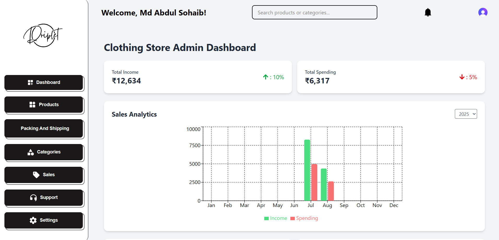
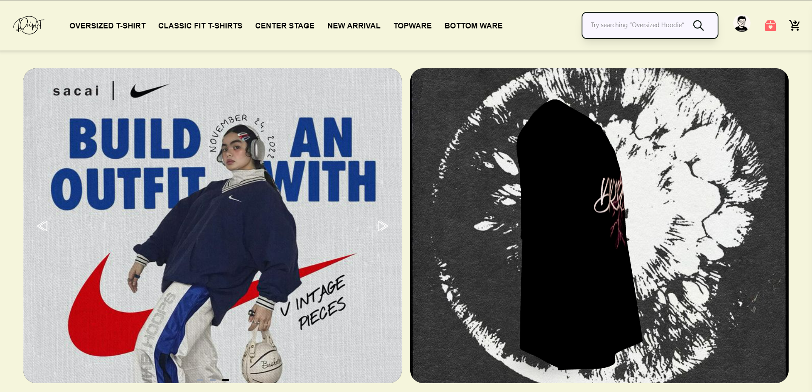

<<<<<<< HEAD
# React + TypeScript + Vite

This template provides a minimal setup to get React working in Vite with HMR and some ESLint rules.

Currently, two official plugins are available:

- [@vitejs/plugin-react](https://github.com/vitejs/vite-plugin-react/blob/main/packages/plugin-react) uses [Babel](https://babeljs.io/) for Fast Refresh
- [@vitejs/plugin-react-swc](https://github.com/vitejs/vite-plugin-react/blob/main/packages/plugin-react-swc) uses [SWC](https://swc.rs/) for Fast Refresh

## Expanding the ESLint configuration

If you are developing a production application, we recommend updating the configuration to enable type-aware lint rules:

```js
export default tseslint.config({
  extends: [
    // Remove ...tseslint.configs.recommended and replace with this
    ...tseslint.configs.recommendedTypeChecked,
    // Alternatively, use this for stricter rules
    ...tseslint.configs.strictTypeChecked,
    // Optionally, add this for stylistic rules
    ...tseslint.configs.stylisticTypeChecked,
  ],
  languageOptions: {
    // other options...
    parserOptions: {
      project: ['./tsconfig.node.json', './tsconfig.app.json'],
      tsconfigRootDir: import.meta.dirname,
    },
  },
})
```

You can also install [eslint-plugin-react-x](https://github.com/Rel1cx/eslint-react/tree/main/packages/plugins/eslint-plugin-react-x) and [eslint-plugin-react-dom](https://github.com/Rel1cx/eslint-react/tree/main/packages/plugins/eslint-plugin-react-dom) for React-specific lint rules:

```js
// eslint.config.js
import reactX from 'eslint-plugin-react-x'
import reactDom from 'eslint-plugin-react-dom'

export default tseslint.config({
  plugins: {
    // Add the react-x and react-dom plugins
    'react-x': reactX,
    'react-dom': reactDom,
  },
  rules: {
    // other rules...
    // Enable its recommended typescript rules
    ...reactX.configs['recommended-typescript'].rules,
    ...reactDom.configs.recommended.rules,
  },
})
```
=======
#  Driplet Clothing Store – Full-Stack MERN eCommerce Platform

A **fashion-focused**, **secure**, and **scalable** full-stack eCommerce platform for customizable T-shirt sales.  
Includes a **custom-built Admin Panel** & **Client Panel** with seamless UI/UX, secure authentication, and integrated payments.

---

## Screenshots

###  Admin Panel


###  Client Panel


> *Note:* Replace `assets/admin-dashboard.png` and `assets/client-home.png` with actual screenshots from your project.

---

## 🚀 Features

 1.**Custom Admin Panel** – Manage products, orders, and inventory  
 2.**Client Panel** – Responsive & fashion-first shopping experience  
 3.**Authentication** – Clerk for Admin, JWT for Clients  
 4.**Payments** – Razorpay (Test Mode) integration  
 5.**Cloud Storage** – Cloudinary for images & videos  
 6.**Automated Emails** – Order confirmation & details sent instantly  
 7.**Free Shipping Integration**  
 8.**Responsive UI** – Optimized for all devices  

---

##  Tech Stack

| Layer         | Technology |
|---------------|------------|
| **Frontend**  | React.js, TypeScript, TailwindCSS |
| **Backend**   | Node.js, Express.js |
| **Database**  | MongoDB |
| **Auth**      | Clerk, JWT |
| **Payments**  | Razorpay |
| **Media**     | Cloudinary |

---

## 📂 Project Structure

Driplet-Clothing-Store-Project1/
│
├── admin/ # Admin Panel (React + TS + TailwindCSS)
├── backend/ # API & Server (Node.js + Express.js)
├── client/ # Client Storefront (React + TS + TailwindCSS)
└── README.md


##  Getting Started

1️ Clone the repo:
```bash
git clone https://github.com/Abdul-Sohaib/Driplet-Clothing-Store-Project1.git
2️ Install dependencies for each folder:


cd admin && npm install
cd ../backend && npm install
cd ../client && npm install
3️ Create .env files in each relevant folder with:

Clerk Keys

JWT Secret

Razorpay Keys

MongoDB URI

Cloudinary Credentials

4️ Run the development servers:

# Admin
cd admin
npm run dev

# Backend
cd backend
npm run dev

# Client
cd client
npm run dev
 Contact
Developer: Abdul Sohaib
LinkedIn | GitHub

 License
This project is licensed under the MIT License.
>>>>>>> a909a49a74d02d18ae9718545c44e1e464f30903
